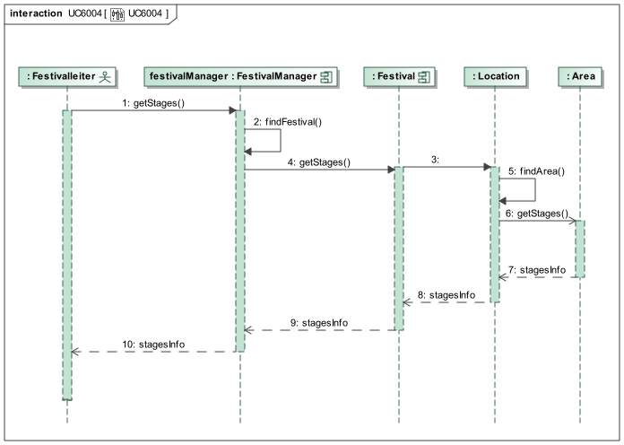
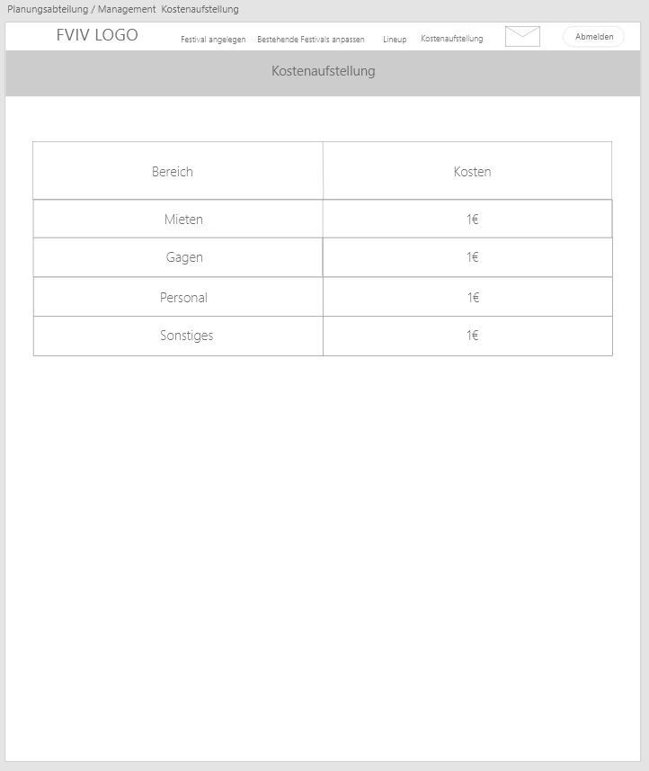

= Pflichtenheft
:toc: macro
:project_name: Festivalmanager
== __{project_name}__

[options="header"]
[cols="1, 1, 1, 1, 4"]
|===
|Version | Status      | Bearbeitungsdatum   | Autoren(en) |  Vermerk
|0.1     | Fertig      | 03.11.2019          |  | Erster Entwurf

|===

== Inhaltsverzeichnis
toc::[]

== 1. Zusammenfassung
Dieses Dokument stellt die Software Requirements Specification (SRS, deutsch: Pflichtenheft) des Projekts Festivalmanager dar. Es soll einen Überblick über das zu erstellende Softwareprodukt geben und dient als Grundlage für die Kommunikation zwischen den Interessengruppen des Projekts, insbesondere dem Kunden und dem Entwicklungsteam. Es ist erwünscht, dieses Dokument als Grundlage für einen Vertrag zwischen dem Auftraggeber und dem Auftragnehmer zu haben, und sollte daher validiert und auf Konsistenz überprüft werden. Das Pflichtenheft beschreibt, was das gewünschte System zu erfüllen hat und teilweise, wie der Auftragnehmer die Lösung umsetzen will.

Dieses Programm bietet mehrere Funktionen. Sie können mehr als ein Festival verwalten und die Finanz-, Lager-, Personal- und Veranstaltungsortverwaltung sowie den Ticketverkauf jedes Festivals in deinem Programm verwalten.

== 2. Aufgabenstellung und Zielsetzung

Das System soll unter anderem in der Planungsabteilung eingesetzt werden, in der Festivals (_Festival_) angelegt werden.
Dazu muss ein Termin (_Festival.Date_ ) festgelegt werden und die passende Location (_Location_) zu diesem Zeitpunkt gebucht werden.
Doppelbuchungen dieser Locations sind unter allen Umständen zu vermeiden. Jede Location bietet Platz für eine maximale Anzahl von Besuchern (_Festival.MaxVisitors_) und Bühnen (_Festival.MaxStages_).
Außerdem ist jede Location in verschiedene, eindeutig gekennzeichnete Bereiche (_Area_) unterteilt, die wiederum einen Teil der maximalen Besucherzahl (_Area.MaxVisitors_) fassen können und sich außerdem in Camping-, Park-, Catering- und Stage-Bereiche (_Type_) einordnen.
Um dem Planungsteam einen guten Überblick zu verschaffen, ist es zwingend notwendig, dass das Gelände und die Bereiche visualisiert werden können (_Layout_). Sobald die Location gebucht ist, können für dieses Festival Anpassungen durchgeführt werden,
wie die Bühnenpositionierung, Toilettenbestückung und Cateringstände, und es muss möglich sein,bestimmte Bereiche zu sperren. Die genannten Gegenstände (Bühnen, usw.) werden von externen Anbietern gemietet (_InventoryManager_).

In der nächsten Stufe muss das „Line-Up“ (_LineUp_) zusammengestellt werden. Dazu müssen Angebote bei verschiedenen Künstlern eingeholt werden. Anschließend werden aus diesen Angeboten Künstler ausgewählt und es muss ein Spielplan für jede Bühne erstellt werden.
Neben den genannten Künstlern ist weiteres Personal erforderlich, wie Sicherheitspersonal (_Security_) (mindestens einer pro 100 Besuchern), Bedienungen an den Cateringständen (_CateringPersonal_), Bühnentechniker (Anzahl wird durch die Band bestimmt), sowie ein Veranstaltungsleiter (_Manager_).
Jede Arbeitskraft wird dabei auf Stundenbasis bezahlt (_ContractManager_).

Zu jedem Zeitpunkt während der Planung muss der Planungsabteilung als auch dem Management eine automatische Kostenaufstellung (_EconomicManager_) zur Verfügung gestellt werden können, in der Kosten für Mieten, Gagen, Personal und Sonstigem aufgelistet und aggregiert werden.

Schon während der Planungsphase kann ein Event freigegeben werden, und es kann ein Kartenpreis festgelegt werden (_TicketManager_). Es gibt dabei Camping-Tickets (_camping_), die das ganze Festival über gültig sind und Tageskarten (_dayticket_).
Diese Tickets werden bis 3 Tage vor Veranstaltungsbeginn in den Filialen der „FVIV GmbH“ verkauft und danach nur noch an der Abendkasse. Es muss den Verkaufsmitarbeitern möglich sein, bei noch vorhandenen Tickets diese zu verkaufen (_saleTicket_) und auszudrucken (_print_).
Auf jedes Ticket wird ein Barcode bzw. eine eindeutige Nummer (_ticket.number_) aufgedruckt, mit dem es dem Personal am Festivaleingang möglich ist, das Ticket auf Gültigkeit hin zu überprüfen und zu vermeiden, dass verschiedene Personen das Gelände mit derselben Karte betreten.

Eine weitere Nutzergruppe ist das Cateringpersonal, das sich an entsprechenden Terminals am Verkaufsstand mit gültigem Login (_Login_) anmeldet. Dort können Getränke und vorgefertigte Speisen ausgewählt und abgerechnet werden (_sellFood_). Dabei wird das Gekaufte vom verfügbaren Lagerbestand (_InventoryManager_) abgezogen.
Sollte ein gewisser Mindestbestand unterschritten werden erfolgt eine Mittteilung an die Festivalleitung (_Message_).

Der Festivalleiter besitzt ebenfalls ein persönliches Terminal, an dem es ihm möglich ist, das Lager einzusehen und Nachbestellungen zu tätigen. Weiterhin sieht er dort aktuelle Besucherzahlen, Nachrichten von anderen Mitarbeitern, sowie Verkaufszahlen des Caterings und die aktuelle Bühnenbelegung.

Überall auf dem Festivalgelände verteilt befinden sich Terminals, die für jeden frei nutzbar sind. Dort sieht man neben einem Plan (_Layout_) vom Festivalgelände auch den Spielplan (_Lineup_) für alle Festivaltage.

Der Manager der „FVIV GmbH“ sorgt für die Verteilung der Logins an die Mitarbeiter und kann sehen, welcher Mitarbeiter momentan am System angemeldet ist (_StaffManager_). Weiterhin soll es ihm möglich sein, betriebswirtschaftliche Daten, wie Umsatz, Ausgaben,... , abzurufen und grafisch zu visualiseren (_EconomicManager_).

Nach der Fertigstellung der Software sollen alle in <<7. Funktionale Anforderungen, Funktionale Anforderungen>> beschriebenen Muss-Kriterien verfügbar und die <<8.1. Qualitätsziele, Qualitätsziele>> erreicht sein.

== 3. Produktnutzung

Dieser Abschnitt gibt einen Überblick darüber, wie das Produkt nach Fertigstellung und unter welchen Umständen verwendet werden soll.

Das System wird von einer Firma für Festivals verwendet, damit die Firma sich um seine Festivals zu kümmern. Die Software soll auf einem Server laufen und interessierten Kunden(Festivalbesucher) über das Internet (über einen Browser) rund um die Uhr zur Verfügung stehen.

Das System muss für die folgenden Browser zugänglich und optisch optimiert sein:

- macOS Safari, Version 13.0.3+
- Google Chrome, Version 78.0.3904.70+

Die Hauptnutzer der Software sind Mitarbeiter in einer Firma, die angeblich typische Website-Navigationsschema kennen.

Alle Daten müssen dauerhaft in einer Datenbank gespeichert sein und über die Application erreichbar sein (z.B. sollten für einen Chef keine SQL-Kenntnisse erforderlich sein).

== 4. Interessensgruppen (Stakeholders)

Hier ist jede Gruppe oder Einzelperson (real oder juristisch) aufgeführt, welche Einfluss auf die Anforderungen des Systems hat.
In der nachstehenden Tabelle sind diese Stakeholder aufgelistet, eine Priorität zugewiesen und ihre übergeordneten Ziele beschrieben.
Die zugewiesenen Prioritäten reichen von 1 (niedrigste Priorität) bis 5 (höchste Priorität).

[options="header", cols="2, ^1, 4, 4"]
|===
|Name
|Priorität (1..5)
|Beschreibung
|Ziele

|FVIV GmbH
|5
|Der Hauptkunde dieses Projekts
a|
- Prozesse automatisieren
- Fehlerfreies Arbeiten

|Festivalbesucher
|2
|Der nicht angemeldete Nutzer dieses Programms
a|
- Gutes Anwendererlebnis
- Übersichtliche Seite
- Schnelle Reaktion im System

|Mitarbeiter
|4
|Die angemeldeten Nutzer des Programms
a|
- Fehlerfreies Arbeiten
- Übersichtliche Anordnung der Funktion

|Administratoren
|3
|Benutzer, die das Programm verwalten sowie später für die Unterhaltung verantwortlich sind.
a|
- Möglichkeit zur Übersicht aller Daten im System
- Prozesse verwalten
- Geringer Unterhaltungsaufwand

|Entwickler
|3
|Personen, die entweder das Programm implementieren
a|
- Leicht erweiterbares Programm
- Gute Debugging-Mechanismen

|===

== 5. Systemgrenze und Top-Level-Architektur

=== 5.1. Kontextdiagramm

Das Systemkontextdiagramm zeigt das geplante System in seiner Umgebung. Dies umfasst alle Benutzertypen, ihre Zugriffsmöglichkeiten auf das System sowie Systeme von Drittanbietern, die auf unser System zugreifen oder von diesem aufgerufen werden (hier nicht der Fall).

[[context_diagram]]
image:models/analysis/Systemgrenze_und_Top-Level-Architektur/festivalmanager_context.svg[context diagram]

=== 5.2. Top-Level-Architektur

Top-Level Ansicht des Systems.

[[TLA]]

== 6. Anwendungsfälle

=== 6.1. Akteure

Akteure sind Nutzer des Systems oder benachbarter Systeme, die auf das System zugreifen. Die folgende Tabelle fasst alle Akteure des Systems zusammen und gibt eine Beschreibung des Akteurs. Abstrakte Akteure (d.h. ein Akteur, der andere Akteure gruppiert, kursiv geschrieben) werden zur Verallgemeinerung und Gruppierung verwendet.

// See http://asciidoctor.org/docs/user-manual/#tables
[options="header"]
[cols="1,4"]
|===
|Name |Beschreibung
[[User]]
|_**<<User>>**_  | Respräsentiert jeden Nutzer des Systems.
[[Nicht_Authentifizierter_Nutzer]]
|**<<Nicht authentifizierter Nutzer>>**  | Respräsentiert jeden nicht authentifizierten Nutzer des Systems.
[[Authentifizierter_Nutzer]]
|_**<<Authentifizierter Nutzer>>**_  | Respräsentiert jeden eingetragenen Nutzer des Systems.
[[Management]]
|**<<Management>>** | Jeder registrierte und authentifizierte Nutzer, mit der Rolle "MANAGEMENT".
[[Ticketverkäufer]]
|**<<Ticketverkäufer>>**  | Jeder registrierte und authentifizierte Nutzer, mit der Rolle "SELLER".
[[Cateringpersonal]]
|**<<Cateringpersonal>>** | Jeder registrierte und authentifizierte Nutzer, mit der Rolle "CATERER".
[[Festivalleiter]]
|**<<Festivalleiter>>**  | Jeder registrierte und authentifizierte Nutzer, mit der Rolle "DIRECTOR".
[[Boss]]
|**<<Boss>>** | Jeder registrierte und authentifizierte Nutzer, mit der Rolle "Boss".
|===

=== 6.2. Überblick Anwendungsfalldiagramm

=== 6.3. Anwendungsfallbeschreibungen
Dieser Unterabschnitt beschreibt die Anwendungsfälle. In dieser Beschreibung müssen noch nicht alle Sonderfälle und Varianten berücksichtigt werden. Schwerpunkt ist es, die wichtigsten Anwendungsfälle des Systems zu finden. Wichtig sind solche Anwendungsfälle, die für den Auftraggeber, den Nutzer den größten Nutzen bringen.
Für komplexere Anwendungsfälle ein UML-Sequenzdiagramm ergänzen.
Einfache Anwendungsfälle mit einem Absatz beschreiben.
Die typischen Anwendungsfälle (Anlegen, Ändern, Löschen) können zu einem einzigen zusammengefasst werden.

[cols="1h, 3"]
[[UC1000]]
|===
|ID                          |**<<UC1000>>**
|Name                        |Login
|Beschreibung                |Ein User soll sich authentifizieren können um Zugriff auf weitere Funktionen zu erhalten.
|Akteure                     |<<Nicht_Authentifizierter_Nutzer>>
|Auslöser                    |User möchte auf versteckte Funktionen zugreifen.
|Voraussetzung(en)          a|User ist ein nicht authentifizierter Nutzer
|Wesentliche Schritte       a|

1. User klickt "Einloggen" in der Navigation
2. User gibt seine Login Daten ein
3. User klickt "Login"
4. Daten werden überprüft und User wird bei korrekten Daten auf Startseite weitergeleitet

|Funktionale Anforderungen   |<<F100>>
|===
image::./models/analysis/Sequenzdiagramme/UC1000.svg["U1000", 100%, 100%, pdfwidth=100%, align=center]

[cols="1h, 3"]
[[UC1001]]
|===
|ID                          |**<<UC1001>>**
|Name                        |Logout
|Beschreibung                |Rückgangig machen des Einloggens.
|Akteure                     |<<Authentifizierter_Nutzer>>
|Auslöser                    |User möchte sich abmelden.
|Voraussetzung(en)          a|User ist ein authentifizierter Nutzer
|Wesentliche Schritte       a|

User klickt "Ausloggen" in der Navigation
User ist jetz unauthentifiziert und die Startseite wird angezeigt

|Funktionale Anforderungen   |<<F102>>
|===
image::./models/analysis/Sequenzdiagramme/UC1001.svg["UC1001", 100%, 100%, pdfwidth=100%, align=center]

[cols="1h, 3"]
[[UC2000]]
|===
|ID                          |**<<UC2000>>**
|Name                        |Account erstellen
|Beschreibung                |Ein Boss soll Accounts für seine Angestellten erstellen können.
|Akteure                     |<<Boss>>
|Auslöser                    |Boss möchte Angestellten Zugriff auf versteckte Funktionen erlauben.
|Voraussetzung(en)          a|User hat die Rolle "Boss"
|Wesentliche Schritte       a|

1. Boss klickt "Organisation" in der Navigation
2. Boss füllt Formular mit Name und Passwort aus
3. Boss bestätigt Eingaben und wird weitergeleitet
4. Account wird angelegt
5. Boss wird auf "Organisation" weitergeleitet

|Funktionale Anforderungen   |<<F103>>
|===
image::./models/analysis/Sequenzdiagramme/UC2000.svg["UC2000", 100%, 100%, pdfwidth=100%, align=center]

[cols="1h, 3"]
[[UC2001]]
|===
|ID                          |**<<UC2001>>**
|Name                        |betriebswirtschaftliche Daten abrufen
|Beschreibung                |Ein Boss soll betriebswirtschaftliche Daten abrufen wie Umsatz, Ausgaben, Gewinn abrufen können.
|Akteure                     |<<Boss>>
|Auslöser                    |Boss möchte Ein- und Ausgaben einsehen.
|Voraussetzung(en)          a|User hat die Rolle "Boss"
|Wesentliche Schritte       a|

1. Boss klickt "Organisation" in der Navigation

|Funktionale Anforderungen   |<<F132>>
|===

[cols="1h, 3"]
[[UC2002]]
|===
|ID                          |**<<UC2002>>**
|Name                        |Angemeldete Mitarbeiter anzeigen
|Beschreibung                |Ein Boss soll abrufen können welche Mitarbeiter derzeitig eingeloggt sind.
|Akteure                     |<<Boss>>
|Auslöser                    |Boss möchte eingeloggte Mitarbeiter sehen
|Voraussetzung(en)          a|Es gibt authentifizierter Nutzer im System
|Wesentliche Schritte       a|

1. Boss klickt "Organisation" in der Navigation

|Funktionale Anforderungen   |<<F133>>
|===
image::./models/analysis/Sequenzdiagramme/UC2002.svg["UC2002", 100%, 100%, pdfwidth=100%, align=center]

[cols="1h, 3"]
[[UC3000]]
|===
|ID                          |**<<UC3000>>**
|Name                        |Speisen/Getränke abrechnen
|Beschreibung                |Ein Caterer soll Speisen online abbuchen können.
|Akteure                     |<<Cateringpersonal>>
|Auslöser                    |Caterer möchte Speisen/Getränke abrechnen
|Voraussetzung(en)          a|Es sind noch Speisen/Getränke auf Lager
|Wesentliche Schritte       a|

1. Caterer klickt "Catering" in Navigation
2. Caterer wählt Speise/Getränk in Formular
3. Caterer gibt Anzahl der gekauften Speisen/Getränke ein
4. Caterer bestätigt und wird weitergeleitet
5. Abrechnung wird bearbeitet und Caterer wird auf "Catering" weitergeleitet

|Funktionale Anforderungen   |<<F134>>
|===
image::./models/analysis/Sequenzdiagramme/UC3000.svg["UC3000", 100%, 100%, pdfwidth=100%, align=center]

[cols="1h, 3"]
[[UC3001]]
|===
|ID                          |**<<UC3001>>**
|Name                        |Verkaufszahlen des Caterings abrufen
|Beschreibung                |Ein Festivalleiter soll die Verkaufszahlen des Cateringbereichs abrufen können.
|Akteure                     |<<Festivalleiter>>
|Auslöser                    |Festivalleiter klickt "Catering" in der Navigation
|Voraussetzung(en)          a|-
|Wesentliche Schritte       a|

1. Festivalleiter klickt "Catering" in Navigation

|Funktionale Anforderungen   |<<F117>>
|===
image::./models/analysis/Sequenzdiagramme/UC3001.svg["UC3001", 100%, 100%, pdfwidth=100%, align=center]

[cols="1h, 3"]
[[UC4000]]
|===
|ID                          |**<<UC4000>>**
|Name                        |Ticket verkaufen
|Beschreibung                |Ein Ticketverkäufer soll Ticktes verkaufen können.
|Akteure                     |<<Ticketverkäufer>>
|Auslöser                    |Kunde möchte Ticket(s) kaufen
|Voraussetzung(en)          a|Es sind Tickets verfügbar
|Wesentliche Schritte       a|

1. Ticketverkäufer klickt "Tickets" in Navigation
2. Ticketverkäufer wählt Ticketart
3. Ticketverkäufer gibt Anzahl der Tickets ein
4. Ticketverkäufer bestätigt und wird weitergeleitet
5. Ticketkauf wird bearbeitet und Ticketverkäufer wird auf auf eine Seite weitergeleitet, auf der er das Ticket ausdrucken kann.

|Funktionale Anforderungen   |<<F125>>
|===
image::./models/analysis/Sequenzdiagramme/UC4000.svg["UC4000", 100%, 100%, pdfwidth=100%, align=center]

[cols="1h, 3"]
[[UC4001]]
|===
|ID                          |**<<UC4001>>**
|Name                        |Ticket drucken
|Beschreibung                |Ein Ticketverkäufer soll Ticktes drucken können.
|Akteure                     |<<Ticketverkäufer>>
|Auslöser                    |Ticketverkäufer möchte Ticket(s) drucken
|Voraussetzung(en)          a|Das Ticket wurde erfolgreich gekauft
|Wesentliche Schritte       a|

1. Ticketverkäufer klickt "Ausdrucken"

|Funktionale Anforderungen   |<<F126>>
|===
image::./models/analysis/Sequenzdiagramme/UC4001.svg["UC4001", 100%, 100%, pdfwidth=100%, align=center]

[cols="1h, 3"]
[[UC5000]]
|===
|ID                          |**<<UC5000>>**
|Name                        |Kostenaufstellung abrufen
|Beschreibung                |Ein Planer soll die Kostenaufstellen jederzeit einsehen können.
|Akteure                     |<<Management>>
|Auslöser                    |Planer möchte Kostenaufstellung einsehen
|Voraussetzung(en)          a|Das Festival wurde angelegt
|Wesentliche Schritte       a|

1. Planer klickt "Planung" in der Navigation

|Funktionale Anforderungen   |<<F131>>
|===
image::./models/analysis/Sequenzdiagramme/UC5000.svg["UC5000", 100%, 100%, pdfwidth=100%, align=center]

[cols="1h, 3"]
[[UC5001]]
|===
|ID                          |**<<UC5001>>**
|Name                        |Bereiche anpassen
|Beschreibung                |Ein Planer soll die Festivalbereiche wie Toiletten, Cateringstände, Bühnen anpassen können.
|Akteure                     |<<Management>>
|Auslöser                    |Planer möchte Bereichsänderung vornehmen
|Voraussetzung(en)          a|Das Festival wurde angelegt
|Wesentliche Schritte       a|

1. Planer klickt "Festival" in der Navigation
2. Planer wählt gewünschten Bereich
3. Planer wählt gewünschte Anpassung wie Position, Menge
4. Planer bestätigt Formular un wird weitergeleitet
5. Änderung wird bearbeitet und Planer wird auf "Festival" weitergeleitet

|Funktionale Anforderungen   |<<F106>>
|===

[cols="1h, 3"]
[[UC6000]]
|===
|ID                          |**<<UC6000>>**
|Name                        |Festivalplan anzeigen
|Beschreibung                |Jeder User soll den Festivalplan einsehen können.
|Akteure                     |<<User>>
|Auslöser                    |User möchte Festivalplan einsehen
|Voraussetzung(en)          a|Das Festival wurde angelegt
|Wesentliche Schritte       a|

1. User klickt "Festival" in der Navigation

|Funktionale Anforderungen   |<<F105>>
|===
image::./models/analysis/Sequenzdiagramme/UC6000.svg["UC6000", 100%, 100%, pdfwidth=100%, align=center]

[cols="1h, 3"]
[[UC6001]]
|===
|ID                          |**<<UC6001>>**
|Name                        |Line-Up anzeigen
|Beschreibung                |Jeder User soll das Line-Up einsehen können.
|Akteure                     |<<User>>
|Auslöser                    |User möchte Line-Up einsehen
|Voraussetzung(en)          a|

1. Das Festival wurde angelegt
2. Es wurden Künstler gebucht

|Wesentliche Schritte       a|

1. User klickt "Festival" in der Navigation

|Funktionale Anforderungen   |<<F112>>
|===

[cols="1h, 3"]
[[UC6002]]
|===
|ID                          |**<<UC6002>>**
|Name                        |Nachrichten von Mitarbeitern abrufen
|Beschreibung                |Ein Festivalleiter soll die Nachrichten von Mitarbeitern abrufen einsehen können.
|Akteure                     |<<Festivalleiter>>
|Auslöser                    |Festivalleiter möchte Nachrichten von Mitarbeitern abrufen
|Voraussetzung(en)          a|Das Festival wurde angelegt
|Wesentliche Schritte       a|

1. Festivalleiter klickt "Festival" in der Navigation

|Funktionale Anforderungen   |<<F121>>
|===

[cols="1h, 3"]
[[UC6003]]
|===
|ID                          |**<<UC6003>>**
|Name                        |Besucherzahlen abrufen
|Beschreibung                |Ein Festivalleiter soll die Besucherzahlen einsehen können.
|Akteure                     |<<Festivalleiter>>
|Auslöser                    |Festivalleiter möchte Besucherzahlen einsehen
|Voraussetzung(en)          a|Das Festival wurde angelegt
|Wesentliche Schritte       a|

1. Festivalleiter klickt "Festival" in der Navigation

|Funktionale Anforderungen   |<<F116>>
|===
image::./models/analysis/Sequenzdiagramme/UC6003.svg["UC6003", 100%, 100%, pdfwidth=100%, align=center]

[cols="1h, 3"]
[[UC6004]]
|===
|ID                          |**<<UC6004>>**
|Name                        |Bühnenbelegung abrufen
|Beschreibung                |Ein Festivalleiter soll die Bühnenbelegung einsehen können.
|Akteure                     |<<Festivalleiter>>
|Auslöser                    |Festivalleiter möchte Bühnenbelegung einsehen
|Voraussetzung(en)          a|Das Festival wurde angelegt
|Wesentliche Schritte       a|

1. Festivalleiter klickt "Festival" in der Navigation

|Funktionale Anforderungen   |<<F115>>
|===

[cols="1h, 3"]
[[UC7000]]
|===
|ID                          |**<<UC7000>>**
|Name                        |Produkte nachbestellen
|Beschreibung                |Ein Festivalleiter soll Produkte nachbestellen können.
|Akteure                     |<<Festivalleiter>>
|Auslöser                    |Festivalleiter möchte Produkte nachbestellen
|Voraussetzung(en)          a|Das Festival wurde angelegt
|Wesentliche Schritte       a|

1. Festivalleiter klickt "Lager" in der Navigation
2. Festivalleiter wählt nachzubestellendes Produkt und Menge aus
3. Festivalleiter bestätigt Formular und wird weitergeleitet
4. Nachbestellung wird verarbeitet und Festivalleiter wird auf "Lager" weitergeleitet

|Funktionale Anforderungen   |<<F118>>
|===

[cols="1h, 3"]
[[UC7001]]
|===
|ID                          |**<<UC7001>>**
|Name                        |Lagerbestand anzeigen
|Beschreibung                |Ein Festivalleiter soll den aktuellen Lagerbestand einsehen können.
|Akteure                     |<<Festivalleiter>>
|Auslöser                    |Festivalleiter möchte Lagerbestand einsehen
|Voraussetzung(en)          a|Das Festival wurde angelegt
|Wesentliche Schritte       a|

1. Festivalleiter klickt "Lager" in der Navigation

|Funktionale Anforderungen   |<<F117>>
|===
image::./models/analysis/Sequenzdiagramme/UC7001.svg["UC7001", 100%, 100%, pdfwidth=100%, align=center]

== 7. Funktionale Anforderungen
Die folgende Tabellen zeigen Funktionale Kriterien des Systems auf, sie sind untergliedert in Muss- und Kannkriterien.
Die Tabellen enthalten:

* eine einzigartige ID für Referenzen
* Die aktuelle Version der Funktion
* Den Namen der Funktion
* Eine Beschreibung der Funktion

=== 7.1. Muss-Kriterien
[options="header"]
[cols="1, 1, 2, 4"]
|===
|ID | Version | Name | Beschreibung
|[[F100]] <<F100>> | 0.1 | Login | Ein nicht angemeldeter Benutzer muss sich durch Eingabe von Nutzername und Passwort Einloggen können um erweiterte Berechtigungen nutzen zu können.
|[[F101]] <<F101>> | 0.1 | Logout | Ein angemeldeter Benutzer muss sich abmelden können sodass nur noch die öffentlichen Teile der App zugänglich sind.
|[[F102]] <<F102>> | 0.1 | Account erstellen | Der Boss muss einen Nutzeraccount erstellen können indem er die Berechtigungen, Nutzername und Passwort angibt.
|[[F103]] <<F103>> | 0.1 | Festival anzeigen | Das System muss alle Informationen zu einem Festival zum Teil graphisch darstellen können.
|[[F104]] <<F104>> | 0.1 | Festival anlegen | Der Boss muss neue Festivals erstellen können unter Angabe von Zeitraum und Ort. Ist nur möglich wenn der Ort zu dieser Zeit noch nicht belegt ist.
|[[F105]] <<F105>> | 0.1 | Lageplan anzeigen | Das System muss zu einem gegeben Festival den Lageplan visualisieren können.
|[[F106]] <<F106>> | 0.1 | Bereich anpassen | Der Festivalleiter muss die Belegung und den Typ eines Bereiches sowie die Anordnung von Toiletten und Cateringständen ändern können.
|[[F107]] <<F107>> | 0.1 | Bereiche sperren | Der Festivalleiter muss Bereiche sperren können.
|[[F108]] <<F108>> | 0.1 | Bühnenposition ändern | Der Festivalleiter muss die Bühnenpositionen ändern können.
|[[F109]] <<F109>> | 0.1 | Toilettenbestückung ändern | Der Festivalleiter muss die Toilettenbestückung ändern können.
|[[F110]] <<F110>> | 0.1 | Cateringstände anpassen | Der Festivalleiter muss die Ausstattung der Cateringstände ändern können.
|[[F111]] <<F111>> | 0.1 | Lineup erstellen | Der Festivalleiter muss aus verfügbaren Künstlern ein Linup für eine Bühne erstellen können.
|[[F112]] <<F112>> | 0.1 | Lineup anzeigen | Das System muss jedes Lineup mit Angabe der Bühne und des Festivals ausgeben können.
|[[F113]] <<F113>> | 0.1 | Angebot einholen | Angebote müssen von Künstlern eingeholt und gespeichert werden können.
|[[F114]] <<F114>> | 0.1 | Angebot annehmen | Ein Angebot eines Künstlers muss bestätigt werden können.
|[[F115]] <<F115>> | 0.1 | Bühnenbelegung abrufen | Der Festivalleiter muss jede Bühnenbelegung abrufen können.
|[[F116]] <<F116>> | 0.1 | Besucherzahlen abrufen | Der Festivalleiter muss die Besucherzahlene abrufen können.
|[[F117]] <<F117>> | 0.1 | Lagerbestand einsehen | Der Festivalleiter muss den Lagerbestand einsehen können.
|[[F118]] <<F118>> | 0.1 | Produkte nachbestellen | Der Festivalleiter muss Produkte nachbestellen können.
|[[F119]] <<F119>> | 0.1 | Produkt hinzufügen | Der Festivalleiter muss dem Lager ein neues Produkt hinzufügen können.
|[[F120]] <<F120>> | 0.1 | Mindestbestand festlegen | Der Festivalleiter muss für ein Produkt den Mindestbestand festlegen können.
|[[F121]] <<F121>> | 0.1 | Nachrichten einsehen | Der Festivalleiter muss Nachrichten von anderen Mitarbeitern einsehen können.
|[[F122]] <<F122>> | 0.1 | Nachricht versenden | Jeder authentifizierte User muss Nachrichten an den Festivalleiter versenden können.
|[[F123]] <<F123>> | 0.1 | Ticketpreis festlegen | Für ein Festival muss der Ticketpreis für jeden Typ getrennt festgelegt werden können.
|[[F124]] <<F124>> | 0.1 | Festival freigeben | Die Tickets für ein Festival müssen zum Verkauf freigegeben können.
|[[F125]] <<F125>> | 0.1 | Ticket verkaufen | Ein Verkäufer muss ein Ticket als verkauft markieren können. Dieses muss dann aus dem Restbestand entfernt werden.
|[[F126]] <<F126>> | 0.1 | Ticket drucken | Ein Ticket muss vom Verkäufer ausgedruckt werden können, vorrausgesetzt es wurde als verkauft markiert.
|[[F127]] <<F127>> | 0.1 | Personal mieten | Personal muss angemietet werden können mit Angabe von Typ des Personals, Anzahl und Stundenlohn.
|[[F128]] <<F128>> | 0.1 | Personal zuordnen | Personal muss einer Arbeitsstelle zugeordnet werden können.
|[[F129]] <<F129>> | 0.1 | Personal abrechnen | Das Gehalt muss für das Personal berechnet und ausgezahlt werden können.
|[[F130]] <<F130>> | 0.1 | Veranstaltungsleiter abrechnen  | Das Gehalt muss für den Veranstaltungsleiter berechnet und ausgezahlt werden können.
|[[F131]] <<F131>> | 0.1 | Gegenstände mieten | Gegenstände müssen unter Angabe des Typs und der Anzahl bestellt, zugeordnet und bezahlt werden können.
|[[F132]] <<F132>> | 0.1 | betriebswirtschaftliche Daten anzeigen | Der Boss muss in der Lage sein sich die betriebswirtschaftlichen Daten anzeigen zu lassen.
|[[F133]] <<F133>> | 0.1 | Aktive Accounts anzeigen | Der Boss muss in der Lage sein alle angemeldeten Accounts sich anzeigen zu lassen.
|[[F134]] <<F134>> | 0.1 | Produkt abrechnen | Das Cateringpersonal muss am Terminal ein Produkt verkaufen können. Lager und betriebswirtschaftliche Daten müssen entsprechend angepasst werden.
|[[F135]] <<F135>> | 0.1 | Kostenaufstellung | Das Management muss sich jederzeit eine Kostenaufstellung anzeigen lassen können. Diese muss gegliedert sein in Personal, Gagen, Mieten und sonstiges.
|===
=== 7.2. Kann-Kriterien
Anforderungen die das Programm leisten können soll, aber für den korrekten Betrieb entbehrlich sind.
[options="header"]
[cols="1, 1, 2, 4"]
|===
|ID | Version | Name | Beschreibung
|[[F201]] <<F201>> | 0.1 | Account Berechtigungen ändern | Der Boss und/ oder der Festivalleiter soll die Berechtigungen von existierenden Accounts ändern können
|[[F202]] <<F202>> | 0.1 | Accounts anzeigen | Der Boss soll sich alle existierenden Accounts und deren zugeordneten Nutzer anzeigen lassen können
|[[F203]] <<F203>> | 0.1 | Messagesystem | Das Messagesystem soll für alle Mitarbeiter ausgeweitet werden.
|[[F204]] <<F204>> | 0.1 | Mehrsprachigkeit | Das System soll in mehreren Sprachen nutzbar sein.
|===
== 8. Nicht-Funktionale Anforderungen

=== 8.1. Qualitätsziele

Die folgende Tabelle enthält nicht funtionale Qualitätsziele und eine Einstufung ihrer Wichtigkeit.
1 = nicht wichtig ... 5 = sehr wichtig

[options="header"]
[cols="4,1,1,1,1,1"]
|===
|Qualitätsziel | 1 | 2 | 3 | 4 | 5
|Wartbarkeit | | | |x |
|Sicherheit | | | | | x
|Nutzerfreundlichkeit | | | x | |
|===

=== 8.2. Konkrete Nicht-Funktionale Anforderungen

[options="header"]
[cols="1, 1, 2, 4"]
|===
|ID | Version | Name | Beschreibung
|[[NF301]] <<NF301>> | 0.1 | uptime | Das System soll 99,5% der Zeit erreichbar sein
|[[NF302]] <<NF302>> | 0.1 | Mehrsprachig | Das System soll die Möglichkeit haben in mehreren Sprachen benutzt zu werden
|[[NF303]] <<NF303>> | 0.1 | Sicherheit - Accounts | Die Accountdaten sollen ein Mindestlevel an Sicherheit haben durch Mindestlänge und Benutzen von Groß- u. Kleinbuchstaben, Zahlen sowie Sonderzeichen
|[[NF304]] <<NF304>>   | 0.1 | Sicherheit - Data | Die betriebswirtschaftlichen Daten sollen nur verschlüsselt gespeichert werden
|===

== 9. GUI Prototyp

Startbildschirm / Index --> ist auf jedem Terminal vor dem Einloggen zu sehen ist.

image::./models/analysis/Index.PNG["Index", 100%, 100%, pdfwidth=100%, align=center]

Bildschirm der Planungsabteilung beim planen der Events --> ist nach dem Login der Planungsabteilung zu sehen.

Bildschirm der Planungsabteilung beim klicken des Anpassen Buttons --> zeigs das Anpassmenü für die einzelnen Events

image::./models/analysis/3. Planungsabteilung Anpassung.PNG["3. Planungsabteilung Anpassung", 100%, 100%, pdfwidth=100%, align=center]

Bildschirm des Planungsabteilung beim  festlegen des LineUps --> zeigs den Chat mit den Künstlern und hilft das LineUp festzulegen.

Bildschirm der Planungsabteilung beim einsehen der Kostenabrechnung --> listet die verschiedenen Kostenpunkte auf und zeigt die einzelnen Kosten davon.

Bildschirm des Terminals beim Kartenkauf --> zeigt was der Kunde sieht beim Kaufen von Karten und was Mitarbeiter sehen beim Verkaufen von Karten

Zeigt das Terminal des Catering Personals --> Zeigt Speisen und Getränke und die Abrechnung der individuellen Posten.

Zeigt das Terminal des Festivalleiters --> Zeigt aktuelle Besucherzahlen und eventuell wichtige Informationen

Zeigt das Lager des Festivals --> Ermöglicht dem Festivalleiter Speisen und Getränke nachzubestellen und das Lieferdatum einzusehen.

Zeigt die aktuellen Cateringzahlen des Festivals --> Zeigt wieviel jeder Stand erwirtschaftet hat und wieviel pro Stunde verkauft wird.

image::./models/analysis/10. Festivalleiter Catering.PNG["10. Festivalleiter Catering", 100%, 100%, pdfwidth=100%, align=center]

Zeigt den aktuellen Chat des Festivalleiters mit den Mitarbeitern --> Ermöchlicht dem Festivalleiter mit seinen Mitarbeitern zu interagieren.

image::./models/analysis/11. Chat von Mitarbeitern.PNG["11. Chat von Mitarbeitern", 100%, 100%, pdfwidth=100%, align=center]

Zeigt die Datenvisualisierung für den Festivalleiter --> Zeigt die betriebswirtschaftlichen Daten und visualiert diese.

image::./models/analysis/12. Der Manager Datenvisualisierung.PNG["12. Der Manager Datenvisualisierung", 100%, 100%, pdfwidth=100%, align=center]

Zeigt das Interface des Managers beim verteilen der Logins --> Ermöglicht bestimmte Logins für bestimmte Bereiche zu verteilen.

image::./models/analysis/13. Der Manager Loginvergabe.PNG["13. Der Manager Loginvergabe", 100%, 100%, pdfwidth=100%, align=center]

Zeigt das Interface des Managers um einzusehen, wer gerade in welchem Bereich online ist.

=== 9.1. Überblick: Dialoglandkarte

=== 9.2. Dialogbeschreibung

-	Vom Index kommt man mittels Login zu der zugehörigen Seite, die je nach Login unterschiedlich ist.
-	Ohne Login kann man den Festivalgeländeplan Button drücken um den Festivalplan zu sehen.
Man kann außerdem oben swipen um  die verschiedenen Spielpläne zu sehen.
-	Außerdem muss es den Besuchern möglich sein mittels Button auf den Karten Index zu kommen um Karten kaufen zu können, die sie bei der FVIV abholen können.

-	Loggt man sich als Planungsabteilungsmitarbeiter ein kommt man zum Planungsabteilung Hauptmenü. Dort kann man mit dem Tab Termine anlegen verschiedene Termine planen an verschiedenen Locations und verschiedene Bereiche visuell einsehen.
-	Außerdem kann die Planungsabteilung auch bestehende Festivals bearbeiten. Dort kann die Planungsabteilung einsehen, wie jede Location aufgebaut ist und gegebenenfalls Bereiche sperren.
-	Außerdem muss ein LineUp Button/Menü vorhanden sein um dem Planungsteam die Gelegenheit zu geben Künstler zu kontaktieren und das LineUp für bestimmte Termine zu planen.
-	Zum Schluss kann die Planungsabteilung auch mittels des Buttons „Kostenaufstellung“ für die individuellen Bereiche die dazugehörigen Kosten einsehen.

-	Den Mitarbeitern, die zuständig sind für den Ticketverkauf ist es möglich mit ihrem Login, Tickets auszudrucken oder zu bestellen, die sich je nach Wunsch unterscheiden zwischen Datum und Campingticket bzw. Tageskarte.

-	Das Catering Team werden durch ihren Login zu einer Seite weitergeleitet, die die verschiedensten Speisen und Getränke listet und die dazugehöre Abrechnung aufzeigt.

-	Der Festivalleiter hat auch einen individuellen Login, der ihm nach Login die aktuelle Bühnenbelegung und die aktuellen Besucherzahlen zeigt, neben anderen nützlichen Informationen. Er hat einen Mitarbeiter Chat Button und zwei weitere für Lager und aktuelle Verkaufszahlen.
-	In dem Lagermenü kann er den aktuellen Lagerbestand einsehen und falls notwendig Lebensmittel oder Sonstiges nachbestellen und das Datum der zu erwartenden Lieferung sehen.
-	Bei dem aktuelle Verkaufszahlen Menü sieht er die Einnahmen der einzelnen Cateringstände und den Ertrag pro Stunde.
-	Der Festivalleiter hat einen Chat mit den Mitarbeitern um über die neusten Ereignisse informiert zu sein.

-	Der Manager kommt nach seinem individuellen Login auf eine Seite, wo er entweder verschiedenste Daten für die einzelnen betriebswirtschaftliche Bereiche visualisieren kann, Logins an Mitarbeiter für die einzelnen Bereiche verteilen kann oder ein Fenster sieht, welcher Mitarbeiter in welchem Bereich gerade eingeloggt ist.

== 10. Datenmodell

=== 10.1. Überblick: Klassendiagramm
UML-Analyseklassendiagramm

image::./models/analysis/Klassendiagramm.PNG["UC5000", 100%, 100%, pdfwidth=100%, align=center]

=== 10.2. Klassen und Enumerationen

Dieser Abschnitt stellt eine Vereinigung von Glossar und der Beschreibung von Klassen/Enumerationen dar. Jede Klasse und Enumeration wird in Form eines Glossars textuell beschrieben. Zusätzlich werden eventuellen Konsistenz- und Formatierungsregeln aufgeführt.

// See http://asciidoctor.org/docs/user-manual/#tables
[options="header"]
|===
|Klasse/Enumeration |Beschreibung
|Area                  |Areas sind einzelne Bestandteile einer Festival-Location, die verschiedene Funktionen (Type) einnehmen können.
|CateringPersonal      |CateringPersonal ist ein Personaltyp, welcher für den Verkauf von Lebensmitteln auf dem Festival zuständig ist.
|Contract              |Ein Contract beschreibt einen Vertrag mit einem Künstler und hält die ausgehandelten Konditionen fest.
|ContractManager       |Der ContractManager verwaltet die Contracts und kann eine Kostenaufstellung über diese liefern.
|EconomicManager       |Der EconomicManager verwaltet die Kosten- und Gewinnpunkte, die mit dem Festival verbunden sind und kann eine Gesamtübersicht erstellen.
|Festival              |Das Festival beschreibt das gesamte Event und beinhaltet einige Getter-Funktionen, über welche sich allgemeine Informationen über das Festival abfragen lassen.
|Festivalmanager       |Der Festivalmanager verwaltet die einzelnen Festivals.
|InventoryManager      |Der InventoryManager dient als Lagersystem, in dem die vorhandenen Items eingesehen, verwaltet und nachbestellt werden können.
|Item                  |Das Item stellt ein zugekauftes Produkte dar, dabei kann es sich um Lebensmittel oder auch um gemietete Dinge wie Bühnen handeln.
|Layout                |Das Layout beinhaltet einen graphischen Grundriss des Festivalgeländes.
|Location              |Die Location fasst alle Areas zusammen und gibt dabei eine Übersicht über die Anzahl der Besucher, Bühnen, etc.
|Login                 |Ein Login beschreibt den Login-Vorgang eines Mitarbeiters mit seinen Zugangsdaten in ein Terminal.
|Manager               |Der Manager ist ein Personaltyp, der das Festival leitet und demtentsprechende Berechtigungen über Personal, Lager und Lineup hat.
|Message               |Eine Message beschreibt eine Nachricht von einem Mitarbeiter an einen anderen.
|MessageController     |Der MessageController verwaltet die Nachrichten und erlaubt es seinen Nutzern, die für ihn bestimmten Messages abzurufen.
|NegativeAmount        |Ein NegativeAmount ist ein Kostenpunkt in der Gesamtübersicht der Ausgaben.
|PositiveAmount        |Ein PositiveAmount ist eine Gewinnquelle in der Gesamtübersicht der Einnahmen
|Security              |Ein Security ist ein Personaltyp, der sich um die Sicherheit und Ticketkontrollen kümmert.
|Staff                 |Staff ist eine Verallgemeinerung der Personaltypen, welche die allgemeinen Eigenschaften für alle Angestellten vordefiniert.
|Staffmanager          |Der Staffmanager ist das Personalverwaltungstool, worüber Personal angelegt und verwaltet werden kann, welches die Login-Daten abgleicht und die Kommunikation der Angestellten untereinander ermöglicht.
|Stage                 |Eine Stage ist eine Bühne mit individuellem Programm (Lineup), welches über diese Klasse auch verändert und eingesehen werden kann.
|Sort                  |Sort gibt die verschiedenen Arten von Tickets an: +
_DAYTICKET_: Ermöglicht den Zutritt nur an einem Tag; kein Zutritt zu Camping-Areas. +
_CAMPING_: Sind während des gesamten Festivals gültig; ermöglichen Zutritt zu den Camping-Areas.
|Ticket                |Ein Ticket dient als Eintrittskarte zum Festival. Jedes Ticket ist einzigartig.
|Ticketmanager         |Der Ticketmanager verwaltet die Tickets beim Verkauf und stellt sicher, dass ein Ticket nicht mehrfach benutzt werden kann.
|TicketSalesman        |Ein TicketSalesman ist ein Personaltyp, der Tickets an Besucher verkaufen und ausdrucken kann.
|Type                  |Der Type spezifiziert die Area und damit ihre Funktionen in der Location: +
_CAMPING_: Ist ein Bereich für Zelte und andere Schlafmöglichkeiten. +
_PARK_: Dient zum Abstellen von Fahrzeugen, welche zur An- und Abreise verwendet werden. +
_CATERING_: In diesem Bereich werden Cateringstände aufgestellt, Essen und Getränke verkauft. +
_STAGE_: In diesem Bereich stehen eine oder mehrere Bühnen, auf denen die Künstler auftreten.
|===

== 11. Akzeptanztestfälle

Mithilfe von Akzeptanztests wird geprüft, ob die Software die funktionalen Erwartungen und Anforderungen im Gebrauch erfüllt. Diese sollen und können aus den Anwendungsfallbeschreibungen und den UML-Sequenzdiagrammen abgeleitet werden. D.h., pro (komplexen) Anwendungsfall gibt es typischerweise mindestens ein Sequenzdiagramm (welches ein Szenarium beschreibt). Für jedes Szenarium sollte es einen Akzeptanztestfall geben. Listen Sie alle Akzeptanztestfälle in tabellarischer Form auf.
Jeder Testfall soll mit einer ID versehen werde, um später zwischen den Dokumenten (z.B. im Test-Plan) referenzieren zu können.

[[AT1000-1]]
[cols="1h, 4"]
|===
|ID                  |<<AT1000-1>>
|Anwendungsfall      |<<UC1000>>
|Voraussetzungen     |Das System hat registrierte Nutzer, Nutzer ist nicht angemeldet.
|Ereignis            |Der Nutzer gibt gültige Anmeldedaten (Nutzername und Passwort) ein und klickt auf "Login".
|Erwartetes Ergebnis |
- Der Nutzer ist mit dem Account entsprechend der Anmeldedaten angemeldet. +
- Der Nutzer hat nun Zugriff auf die Funktionen diese Programms, die für seinen Personaltyp freigeschalten sind.
|===

[[AT1001-1]]
[cols="1h, 4"]
|===
|ID                  |<<AT1001-1>>
|Anwendungsfall      |<<UC1001>>
|Voraussetzungen     |Der Nutzer ist angemeldet.
|Ereignis            |Der Nutzer klickt auf "Logout".
|Erwartetes Ergebnis |
- Der Nutzer ist nun nicht mehr mit seinem Account angemeldet. +
- Ihm stehen nun nur noch die Funktionen zur Verfügung, für die keine Authentifizierung benötigt ist.
|===

[[AT2000-1]]
[cols="1h, 4"]
|===
|ID                  |<<AT2000-1>>
|Anwendungsfall      |<<UC2000>>
|Voraussetzungen     |
- Der ausführende Benutzer hat die Rolle Boss. +
- Die Nutzerdaten, welche für den neuen Account verwendet werden sollen, sind noch nicht im System verwendet.
|Ereignis            |Der Boss gibt die neuen Nutzerdaten in das dafür vorgesehene Formular ein und bestätigt mit "Erstellen".
|Erwartetes Ergebnis |
- Es wird ein neuer Benutzer mit der angegebenen Rolle (und den damit einhergehenden Berechtigungen) und den eingegebenen Nutzerdaten erstellt. +
- Der Boss wird auf die Personalverwaltungsseite weitergeleitet.
|===

[[AT2000-2]]
[cols="1h, 4"]
|===
|ID                  |<<AT2000-2>>
|Anwendungsfall      |<<UC2000>>
|Voraussetzungen     |
- Der ausführende Benutzer hat nicht die Rolle Boss. +
- Die Nutzerdaten, welche für den neuen Account verwendet werden sollen, sind noch nicht im System verwendet.
|Ereignis            |Der Benutzer kann auf das von ihm gesuchte Formular nicht zugreifen.
|Erwartetes Ergebnis |
- Es wird ein kein neuer Benutzer erstellt. +
- Der angemeldete Benutzer bekommt eine Fehlerbeldung.
|===

[[AT2000-3]]
[cols="1h, 4"]
|===
|ID                  |<<AT2000-3>>
|Anwendungsfall      |<<UC2000>>
|Voraussetzungen     |
- Der ausführende Benutzer hat die Rolle Boss. +
- Die Nutzerdaten, welche für den neuen Account verwendet werden sollen, sind schon von einem anderen Nutzer im System belegt.
|Ereignis            |Der Boss gibt die neuen Nutzerdaten in das dafür vorgesehene Formular ein und bestätigt mit "Erstellen".
|Erwartetes Ergebnis |
- Der Boss bekommt eine Mitteilung, dass die von ihm eingegebenen Nutzerdaten bereits belegt sind. +
- Der Boss wird zurück auf das Eingabeformular geleitet.
|===

[[AT2001-1]]
[cols="1h, 4"]
|===
|ID                  |<<AT2001-1>>
|Anwendungsfall      |<<UC2001>>
|Voraussetzungen     |Der Nutzer ist als Boss angemeldet und es gibt das Festival, dessen Daten abgerufen werden sollen.
|Ereignis            |Der Boss klickt auf den entsprechenden Reiter im Menü.
|Erwartetes Ergebnis |Der Boss wird auf eine neue Seite weitergeleitet, auf der alle Ausgaben und Einnahmen aufgelistet und eine Gesamtsumme berechnet wird.
|===

[[AT2002-1]]
[cols="1h, 4"]
|===
|ID                  |<<AT2002-1>>
|Anwendungsfall      |<<UC2002>>
|Voraussetzungen     |Der Nutzer ist als Boss angemeldet, es gibt authentifizierte Nutzer im System.
|Ereignis            |Der Boss klickt auf den entsprechenden Reiter im Menü.
|Erwartetes Ergebnis |Der Boss wird auf eine neue Seite weitergeleitet, auf der alle angemeldeten Nutzer des Sytems angzeigt werden.
|===

[[AT2002-2]]
[cols="1h, 4"]
|===
|ID                  |<<AT2002-2>>
|Anwendungsfall      |<<UC2002>>
|Voraussetzungen     |Der Nutzer ist als Boss angemeldet, es gibt außer ihm keine weiteren authentifizierte Nutzer im System.
|Ereignis            |Der Boss klickt auf den entsprechenden Reiter im Menü.
|Erwartetes Ergebnis |Der Boss wird auf eine neue Seite weitergeleitet, auf der nur er als angemeldeter Nutzer des Sytems angzeigt wird.
|===

[[AT3000-1]]
[cols="1h, 4"]
|===
|ID                  |<<AT3000-1>>
|Anwendungsfall      |<<UC3000>>
|Voraussetzungen     |
- Der Nutzer ist als Catering-Mitarbeiter angemeldet. +
- Es gibt noch Artikel im Lagen, die verkauft werden können.
|Ereignis            |Der Catering-Mitarbeiter wählt auf der Catering-Seite das entsprechende Produkt aus und gibt dazu die gewünschte Menge an.
|Erwartetes Ergebnis |
- Die entsprechende Anzahl wurde von dem Produkt im Lager abgezogen. +
- Nach dem Bestätigen des Auftrags wird der Nutzer zurück zur Catering-Seite geleitet.
|===

[[AT3000-2]]
[cols="1h, 4"]
|===
|ID                  |<<AT3000-2>>
|Anwendungsfall      |<<UC3000>>
|Voraussetzungen     |
- Der Nutzer ist als Catering-Mitarbeiter angemeldet. +
- Es gibt nicht mehr genug von dem gewünsten Artikel im Lager.
|Ereignis            |Der Catering-Mitarbeiter wählt auf der Catering-Seite das entsprechende Produkt aus und gibt dazu die gewünschte Menge an.
|Erwartetes Ergebnis |
- Der Catering-Mitarbeiter bekommt eine Fehlermeldung und die noch verfügbare Anzahl des Produktes, die noch im Lager sind. +
- Der Nutzer wird zurück zur Catering-Seite geleitet.
|===

[[AT3001-1]]
[cols="1h, 4"]
|===
|ID                  |<<AT3001-1>>
|Anwendungsfall      |<<UC3000>>
|Voraussetzungen     |Der Nutzer ist als Boss im System angemeldet.
|Ereignis            |Der Boss klickt auf den entsprechenden Reiter in der Navigation.
|Erwartetes Ergebnis |Der Nutzer wird auf eine neue Seite weitergeleitet, die die verkauften Produkte auflistet, dazu die Anzahl und die Stückzahl der verbleibenden im Lager
|===

[[AT4000-1]]
[cols="1h, 4"]
|===
|ID                  |<<AT4000-1>>
|Anwendungsfall      |<<UC4000>>
|Voraussetzungen     |
- Der Ticketverkauf ist freigegeben. +
- Es sind noch mindestens drei Tage bis zum Festivalbeginn. +
- Es sind noch Tickets vom richtigen Typ verfügbar
|Ereignis            |Der angemeldete Nutzer wählt die gewünschte Art und Anzahl der Tickets.
|Erwartetes Ergebnis |Die Tickets werden im System als verkaufte Tickets registriert.
|===

[[AT4000-2]]
[cols="1h, 4"]
|===
|ID                  |<<AT4000-2>>
|Anwendungsfall      |<<UC4000>>
|Voraussetzungen     |
- Der Ticketverkauf ist freigegeben. +
- Es sind weniger als drei Tage bis zum Festivalbeginn.
|Ereignis            |Der angemeldete Nutzer wählt die gewünschte Art und Anzahl der Tickets.
|Erwartetes Ergebnis |Der Verkäufer erhält eine Fehlermeldung, welche auf die Abendkasse verweist.
|===

[[AT4000-3]]
[cols="1h, 4"]
|===
|ID                  |<<AT4000-3>>
|Anwendungsfall      |<<UC4000>>
|Voraussetzungen     |
- Der Ticketverkauf ist freigegeben. +
- Es sind noch mindestens drei Tage bis zum Festivalbeginn. +
- Es sind keine Tickets vom richtigen Typ verfügbar
|Ereignis            |Der angemeldete Nutzer wählt die gewünschte Art und Anzahl der Tickets.
|Erwartetes Ergebnis |Der Verkäufer erhält eine Fehlermeldung und wird zurück auf die Verkaufsseite verwiesen.
|===

[[AT4001-1]]
[cols="1h, 4"]
|===
|ID                  |<<AT4001-1>>
|Anwendungsfall      |<<UC4001>>
|Voraussetzungen     |Die Tickets sind als gekauft im System registriert.
|Ereignis            |Der Verkäufer gibt die Ticketnummer in das System ein und bestätigt die Eingabe.
|Erwartetes Ergebnis |Der Verkäufer wird auf eine neue Seite geleitet, auf welcher das Ticket angezeigt wird und ausgedruckt werden kann.
|===

[[AT5000-1]]
[cols="1h, 4"]
|===
|ID                  |<<AT5000-1>>
|Anwendungsfall      |<<UC5000>>
|Voraussetzungen     |
- Ein Festival wurde angelegt. +
- Der Nutzer ist als Management-Mitglied authentifiziert.
|Ereignis            |Der Nutzer klickt auf den Button in der Navigation.
|Erwartetes Ergebnis |Der Nutzer wird auf eine neue Seite geleitet, auf der die Kosten- und Gewinnpunkte aufgelistet sind.
|===

[[AT5001-1]]
[cols="1h, 4"]
|===
|ID                  |<<AT5001-1>>
|Anwendungsfall      |<<UC5001>>
|Voraussetzungen     |Ein Festival wurde erstellt.
|Ereignis            |Der Planer wählt in der Übersicht den gewünschten Bereich aus, der Verändert werden soll.
|Erwartetes Ergebnis |Es öffnet sich ein neues Fenster, in dem der Bereich bearbeitet werden kann.
|===

[[AT5001-2]]
[cols="1h, 4"]
|===
|ID                  |<<AT5001-2>>
|Anwendungsfall      |<<UC5001>>
|Voraussetzungen     |Das Fenster zur Bearbeitung eines Bereichs ist geöffnet.
|Ereignis            |Die Konfiguration des Bereichs wird vom Planer verändert und mit "OK" bestätigt.
|Erwartetes Ergebnis |
- Die aktualisierte Konfiguration wird in die Location übernommen. +
- Der Planer wird auf die Übersichts-Seite weitergeleitet.
|===

[[AT6000-1]]
[cols="1h, 4"]
|===
|ID                  |<<AT6000-1>>
|Anwendungsfall      |<<UC6000>>
|Voraussetzungen     |
- Ein Festival mit einem Lageplan muss erstellt werden. +
- Der Nutzer darf nicht authentifiziert sein.
|Ereignis            |Der Nutzer ruft den Festivalplan auf.
|Erwartetes Ergebnis |Der Nutzer wird auf eine Seite weitergeleitet, auf der der Festivalplan angezeigt wird.
|===

[[AT6001-1]]
[cols="1h, 4"]
|===
|ID                  |<<AT6001-1>>
|Anwendungsfall      |<<UC6001>>
|Voraussetzungen     |
- Ein Festival mit einem Lineup muss erstellt werden. +
- Der Nutzer darf nicht authentifiziert sein.
|Ereignis            |Der Nutzer ruft das Lineup auf.
|Erwartetes Ergebnis |Der Nutzer wird auf eine Seite weitergeleitet, auf der das Lineup angezeigt wird.
|===

[[AT6002-1]]
[cols="1h, 4"]
|===
|ID                  |<<AT6002-1>>
|Anwendungsfall      |<<UC6002>>
|Voraussetzungen     |Der Nutzer muss als Festivalleiter eingeloggt sein.
|Ereignis            |Der Festivalleiter klickt auf den Button "Nachrichten".
|Erwartetes Ergebnis |Er wird auf eine neue Seite weitergeleitet, auf der die Mitteilungen aufgelistet werden.
|===

[[AT6003-1]]
[cols="1h, 4"]
|===
|ID                  |<<AT6003-1>>
|Anwendungsfall      |<<UC6003>>
|Voraussetzungen     |
- Der Nutzer muss als Festivalleiter eingeloggt sein. +
- Das Festival muss angelegt sein.
|Ereignis            |Der Festivalleiter ruft über die Navigationsleiste die Besucherzahlen auf.
|Erwartetes Ergebnis |Ihm wird die Besucherzahlen angezeigt.
|===

[[AT6004-1]]
[cols="1h, 4"]
|===
|ID                  |<<AT6004-1>>
|Anwendungsfall      |<<UC6004>>
|Voraussetzungen     |
- Der Nutzer ist als Festivalleiter angemeldet sein. +
- Es muss ein Festival mit mindestens einer Bühne geben.
|Ereignis            |Der Festivalleiter klickt auf den Button zur aktuellen Bühnenbelegung.
|Erwartetes Ergebnis |Ihm wird die Bühnenbelegung präsentiert.
|===

[[AT7000-1]]
[cols="1h, 4"]
|===
|ID                  |<<AT7000-1>>
|Anwendungsfall      |<<UC7000>>
|Voraussetzungen     |
- Der Nutzer ist als Festivalleiter angemeldet.
- Es gibt ein Festival mit einem Lager.
|Ereignis            |Der Festivalleiter gibt in dem entsprechenden Formular das zu bestellende Produkt und die dazugehörige Menge an.
|Erwartetes Ergebnis |
- Die Kosten werden als Kostenpunkt der Kostenaufstellung hinzugefügt. +
- Die Produkte werden zum Lagerbestand addiert.
|===

[cols="1h, 4"]
[[AT7001-1]]
|===
|ID                  |<<AT7001-1>>
|Anwendungsfall      |<<UC7001>>
|Voraussetzungen     |
- Der Nutzer ist als Festivalleiter angemeldet. +
- Es gibt ein Festival mit einem Lager.
|Ereignis            |Der Festivalleiter ruft über einen Button den Lagerbestand ab.
|Erwartetes Ergebnis |Er wird auf eine Seite weitergeleitet, auf der ihm alle gelagerten Produkte und ihre Quantität angezeigt wird.
|===

== 12. Glossar

[options="header", cols="1h, 4"]
|===
|Begriff             |Erklärung
|Akteure             |Alle späteren Nutzer des Programms.
|Boss                | Eventuell verwendete Synonyme sind Festivalleiter oder Manager, also die Person, der die Leitung über ein Festival übertragen wurde.
|Camping             | Ermöglicht es den Besuchern, über Nacht auf dem Gelände zu bleiben und dort in selbst mitgebrachten Zelten zu schlafen.
|Catering            |Bezeichnet die Lebensmittelversorgung: An festgelegten Ständen werden Lebensmittel und Getränke vom Personal verkauft. 
|Festival(-Besucher) |Kunde der FVIV GmbH, welcher über eine Eintrittskarte Zugang zu einem Festival ersteht.
|Inventar            |Bezeichnet alle zugekauften Dinge, welche zur Verwendung zur Verfügung stehen.
|Lineup              |Fasst mehrere Bühnenauftritte zu einem kompletten Bühnenprogramm zusammen.
|Location            |Fasst alle Aspekte des Veranstaltungsortes zusammen, von der Fläche, über die Bühnenpositionierung, bis zu den Sanitäranlagen.
|Login               |Erfolgreiches Anmelden eines Mitarbeiters im System. 
|Personal            | Unter Personal werden alle Personen zusammengefasst, welche mit ihrer Arbeitskraft zum Erfolg des Festivals beitragen.
|Security            |Sicherheitspersonal, welches für die Sicherheit des Publikums und der Künstler und die Eingangskontrollen zuständig ist.
|Stakeholder         |Alle Leute, die bei dem Design des Programms Mitspracherecht besitzen.
|Ticket              | Ermöglicht den Eintritt in das Festivalgelände als Kunde bzw. Besucher.
|Vertrag             |Wird zwischen Festivalleitung und Künstler geschlossen, regelt die Rahmenbedingungen für einen Auftritt.
|===

== 13. Offene Punkte

Offene Punkte werden entweder direkt in der Spezifikation notiert. Wenn das Pflichtenheft zum finalen Review vorgelegt wird, sollte es keine offenen Punkte mehr geben.
